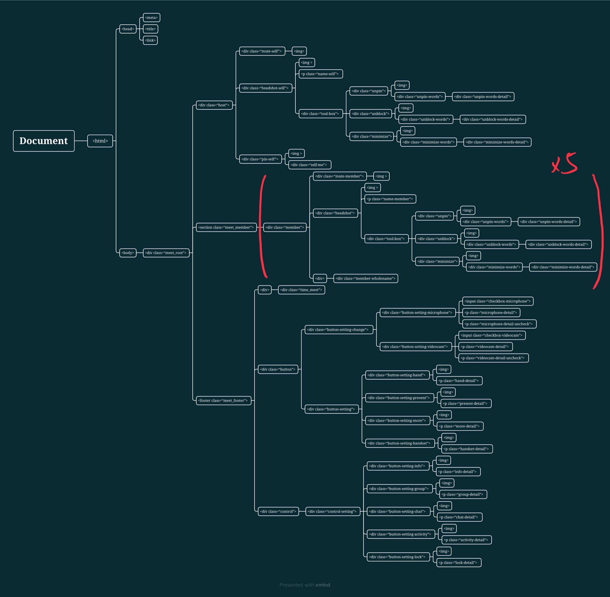
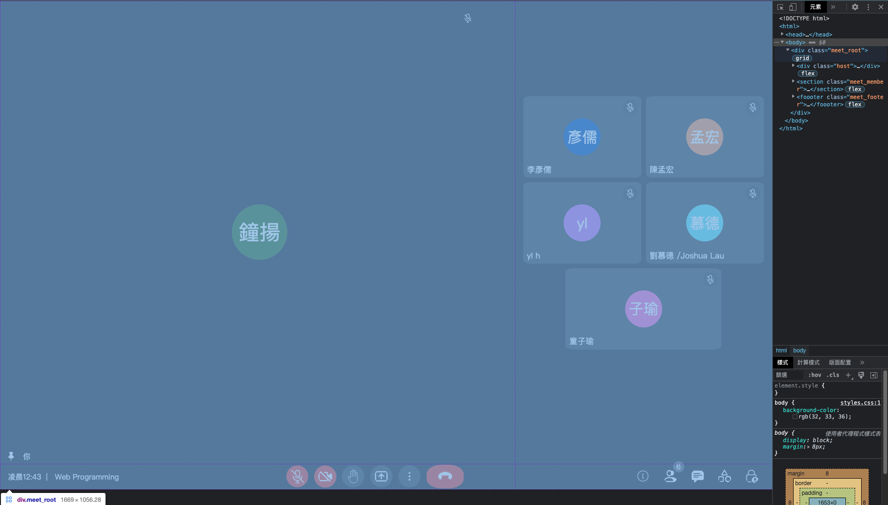
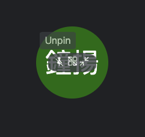
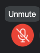
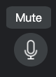

# Web Programming HW#1
All requiments are done in this homework

## DOM

This is the whole structure of the HTML

## CSS
I will introduce the important concepts about how to implement this homework requirements briefly
### .meet_root
The whole screen is split in to three parts by the grid-template

### .headshot-self (.headshot-self:hover .tool-box)
Use hover and opacity to complete this function. If the headshot is hovered, the toolbox will appear

### .tool-box (.headshot-self:hover .tool-box:hover)
If the tool-box is hovered, the opacity will change.

### .unpin-words 
The hint words are also implemented by hover. First setting *display: none* and if the certain graph is hovered, setting  *display: flex*

### .checkbox-microphone[type="checkbox"] 
(There are several related CSS, I only list one to illustrate)

The switch of mute/unmute is implemented by *input type="checkbox"*. By using command to detect the checked or unchecked situation, the function can be made. 

Besides, the hint box is conducted by hover like the toolbox above.

### @media
The RWD is done by modifiing the grid-template when the max-height change.