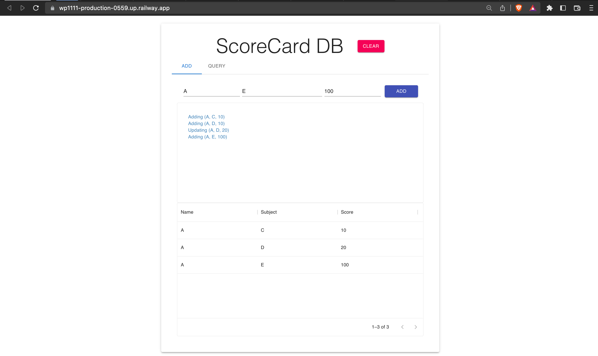

# HW9 Deployment

## 全端服務網址

wp1111-production-0559.up.railway.app

## 開啟日期及時段

2022/12/26 09:00 ~ 2023/01/02 23:59

## Deployment流程

### Code更改

1. server只能放backend/，不能放在backend/src/
2. 按照助教的指令更改frontend/src/api.js, frontend/package.json及backend/server.js, backend/package.json

### Railway建立

1. 建立Railway帳號並指定以github連接
2. 將setting中將root directory設定在hw9
3. 要在railway裡自訂.env裡面定義的變數

### Docker

1. 在hw9/建立Dockerfile
2. 建立docker-compose.yml（雖然這個好像沒什麼用就是了）

### 最終結果

### 遇到的困難

有點不懂為什麼在railway上build一開始都會失敗，但restart之後就好了，很困惑。
